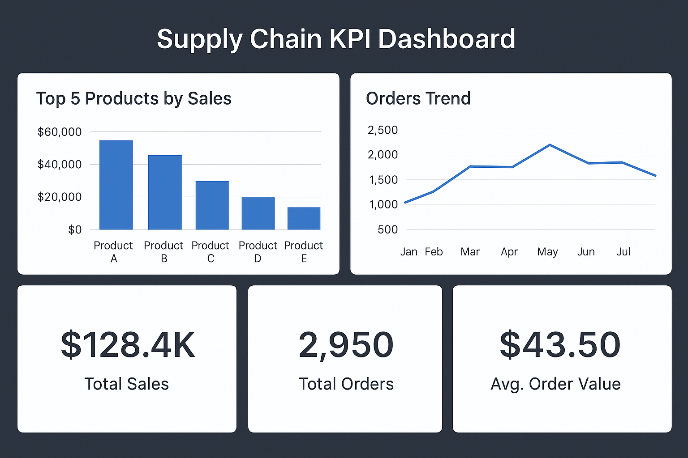

# 📦 Supply Chain KPI Dashboard

An end-to-end **Supply Chain Analytics Project** designed to track and optimize key performance indicators (KPIs) such as on-time delivery, vendor performance, and demand forecasting.  
This project combines **SQL, Python, and Power BI/Tableau** to provide real-time insights into order management and inventory efficiency.

---

## 🚀 Features
- Automated **data pipeline** from raw CSV orders → cleaned dataset.  
- **SQL scripts** for KPI calculations (on-time delivery, inventory turnover, vendor analysis).  
- **Python scripts** for demand forecasting and KPI extraction.  
- **Interactive Dashboard** (Power BI/Tableau/Python visualization).  
- Reproducible workflow for recruiters to test.  

---

## 🛠️ Tech Stack
- **Programming:** Python (Pandas, Matplotlib, NumPy)  
- **Database:** MySQL / SQLite (schema & queries)  
- **Visualization:** Power BI, Tableau, Matplotlib  
- **Tools:** GitHub, Jupyter Notebook  

---

## 📊 Example KPIs
- On-time Delivery Rate  
- Average Order Delay  
- Inventory Turnover  
- Vendor Performance Score  
- Forecasted Demand (Next 30 days)  

---

## 📂 Repository Structure
supply-chain-kpi-analytics/
│── README.md
│── LICENSE
│── .gitignore
│── requirements.txt
│
├── data/
│ ├── raw/ → Raw order data (CSV)
│ └── processed/ → Cleaned dataset
│
├── sql/
│ ├── schema.sql
│ └── kpi_queries.sql
│
├── notebooks/
│ └── demand_forecast.ipynb
│
├── scripts/
│ ├── generate_data.py
│ └── kpi_calculator.py
│
└── dashboards/
├── powerbi_dashboard.pbix
└── screenshots/dashboard_preview.png


---

## 🖥️ Dashboard Preview


---

## 📌 How to Run
1. Clone the repo:
   ```bash
   git clone https://github.com/YOUR_USERNAME/supply-chain-kpi-analytics.git
   
2. Install dependencies:
bash
Copy code
pip install -r requirements.txt

3.Generate sample data:

bash
Copy code
python scripts/generate_data.py

4.Run KPI calculations:

bash
Copy code
python scripts/kpi_calculator.py

5.Open notebooks/demand_forecast.ipynb to view demand forecasting.
